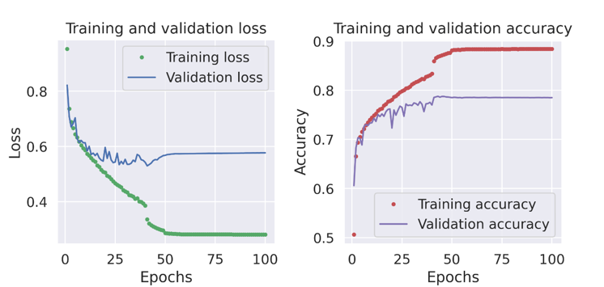
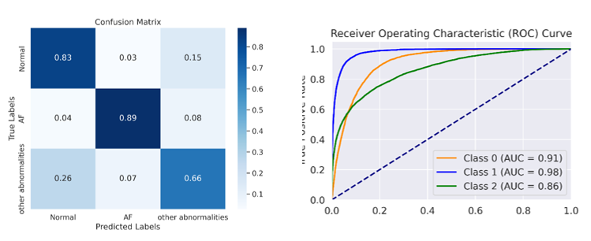
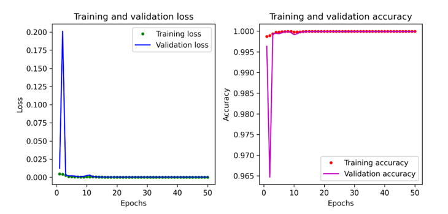
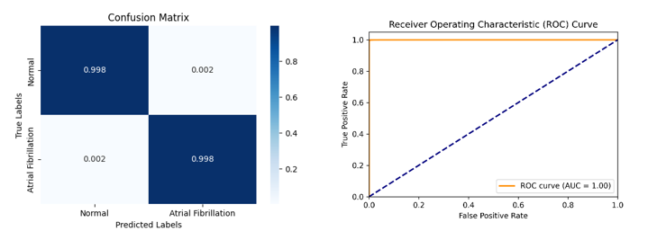
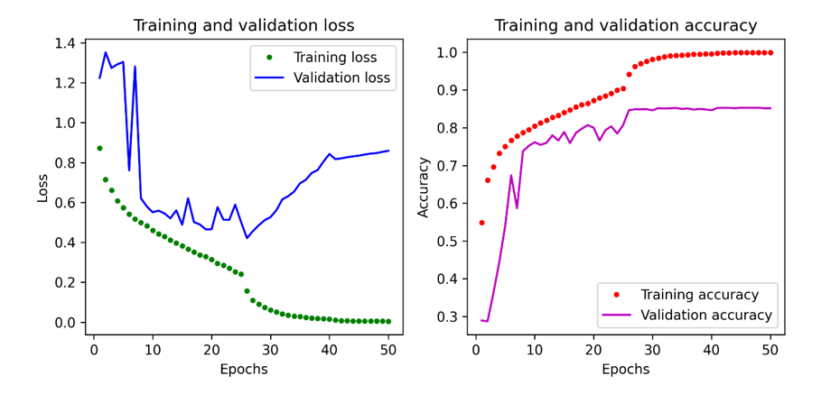
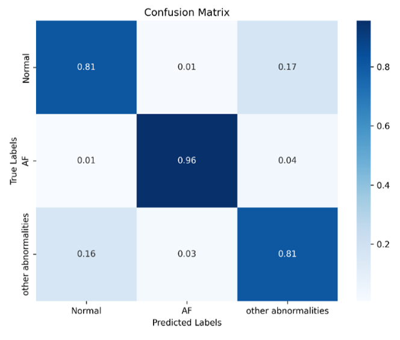
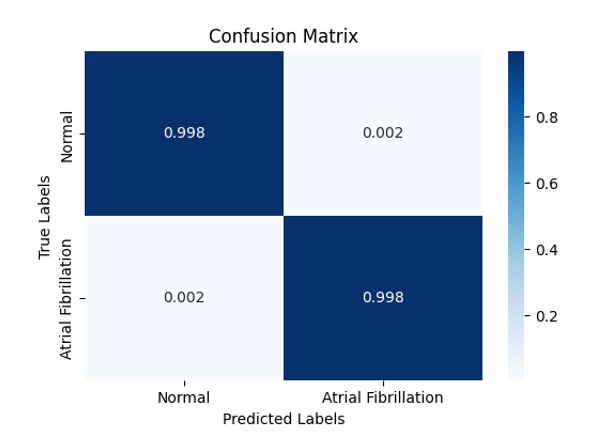

# Lightweight_Models_for_ECG_dataset
## Compact Deep Convolutional Neural Networks (DCNNs) for ECG Classification

Compact Deep Convolutional Neural Networks (DCNNs), based on **ResNet** and **MobileNet V2** architectures, are designed to efficiently classify ECG signals as either:  
- **Normal**  
- **Indicative of Atrial Fibrillation**

### Key Features:
- **Efficiency**: These models are optimized for the classification of ECG signals.  
- **Compact Design**: The architectures reduce the number of parameters, making them lightweight and efficient.  
- **Suitability for Low-Resource Settings**: The reduced parameter count ensures these models are ideal for deployment in environments with limited computational resources.

  # Model Performance of MobileNetV2 Architecture

## Accuracy Curve & Loss Curve for Multiclassification
 

## Confusion Matrix for Multiclassification

## Accuracy Curve & Loss Curve for Binaryclassification  
  

 ## Confusion Matrix for Binaryclassification
 

# Model Performance of ResNet Architecture
## Accuracy Curve & Loss Curve for Multiclassification

## Confusion Matrix for Multiclassification

## Accuracy Curve & Loss Curve for Binaryclassification  
 

 ## Confusion Matrix for Binaryclassification

 
